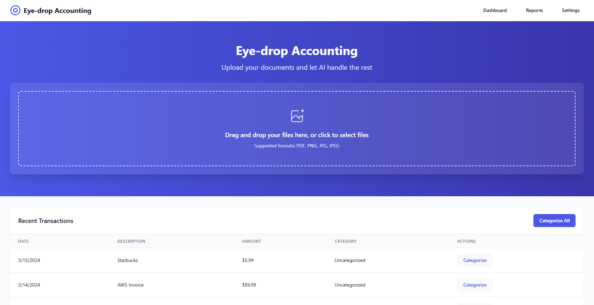

# Eye Drop Accountant 🧾

A modern web application that uses AI to analyze and extract information from receipts and invoices. Built with React, TypeScript, and OpenAI's GPT-4 Vision API.

[](https://eye-drop-accountant.onrender.com/)



*Modern drag-and-drop interface & Detailed receipt analysis results*

## ✨ Features

- 📸 Upload receipts via drag-and-drop or file selection
- 🤖 AI-powered receipt analysis using GPT-4 Vision
- 📝 Automatic extraction of:
  - Vendor information
  - Total amount
  - Date
  - Line items with quantities and prices
- 🎨 Beautiful, responsive UI with dark mode
- ⚡ Real-time processing and feedback
- 🔄 Retry functionality for failed analyses
- 🚨 Comprehensive error handling

## 🛠️ Tech Stack

- **Frontend**: React, TypeScript, Tailwind CSS
- **AI Integration**: OpenAI GPT-4 Vision API
- **OCR**: Tesseract.js
- **Deployment**: Render
- **Styling**: Tailwind CSS with custom animations

## 🚀 Getting Started

### Prerequisites

- Node.js (v16 or higher)
- npm or yarn
- OpenAI API key

### Installation

1. Clone the repository:
   ```bash
   git clone https://github.com/yourusername/eye-drop-accountant.git
   cd eye-drop-accountant
   ```

2. Install dependencies:
   ```bash
   npm install
   # or
   yarn install
   ```

3. Create a `.env` file in the root directory:
   ```
   VITE_OPENAI_API_KEY=your_openai_api_key
   ```

4. Start the development server:
   ```bash
   npm run dev
   # or
   yarn dev
   ```

## 🤝 Contributing

Contributions are welcome! Please feel free to submit a Pull Request.

## 📝 License

This project is licensed under the MIT License - see the [LICENSE](LICENSE) file for details.

## 👨‍💻 Author

**Rowell Camero**
- Portfolio: [rowell-camero-portfolio.onrender.com](https://rowell-camero-portfolio.onrender.com/)
- LinkedIn: [linkedin.com/in/rowell-camero-67b868249](https://linkedin.com/in/rowell-camero-67b868249)
- Email: hdreamdev@gmail.com

## 🙏 Acknowledgments

- OpenAI for their amazing GPT-4 Vision API
- The React and TypeScript communities
- All contributors and users of this project

---

Made with ❤️ by Rowell Camero
